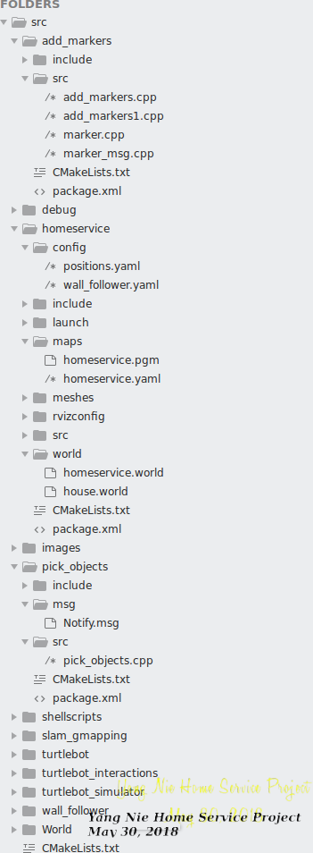
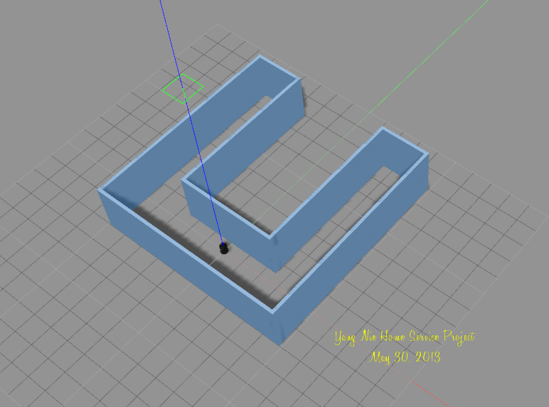
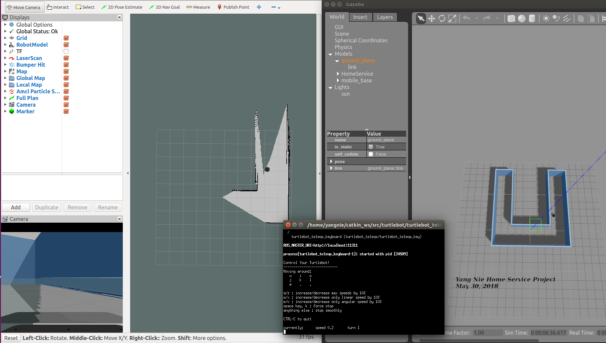
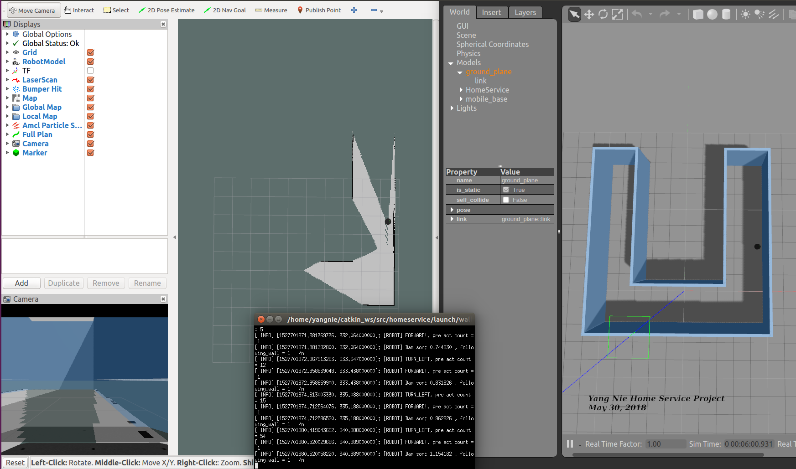
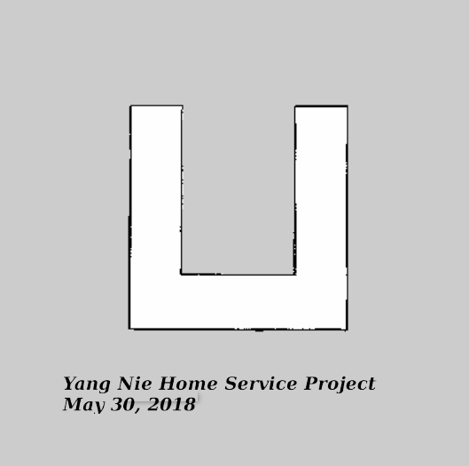
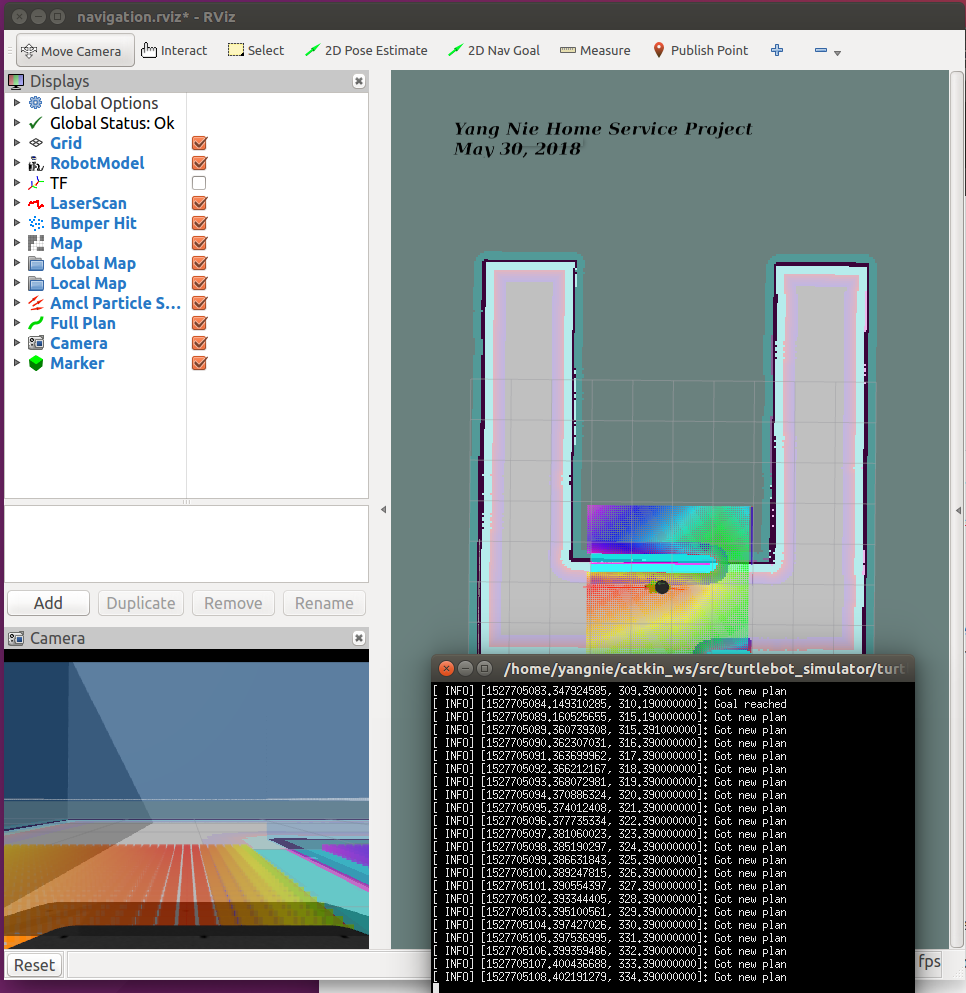
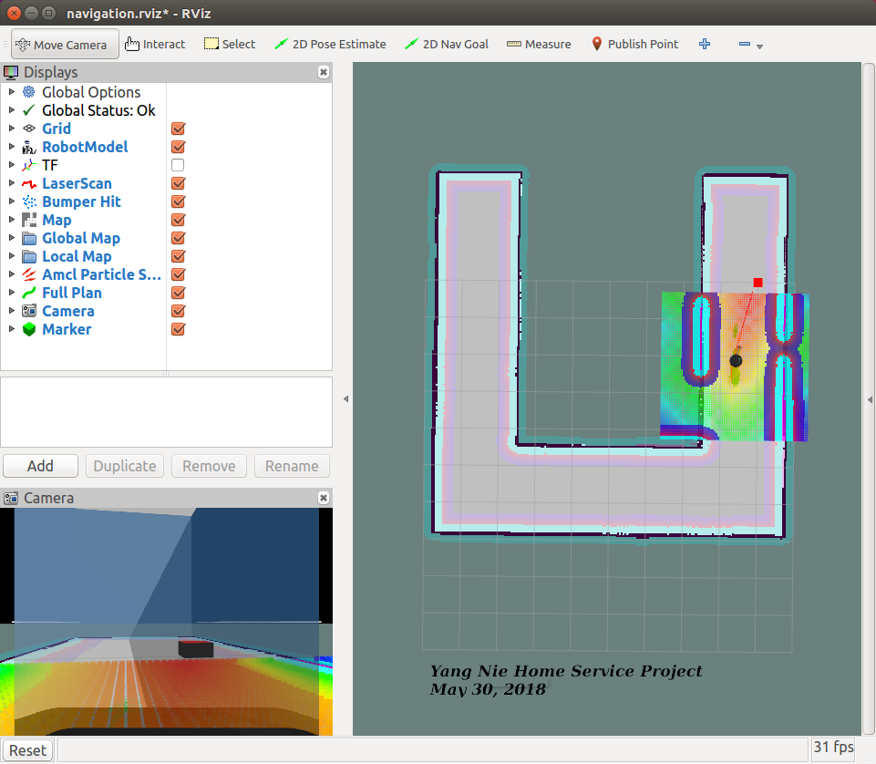
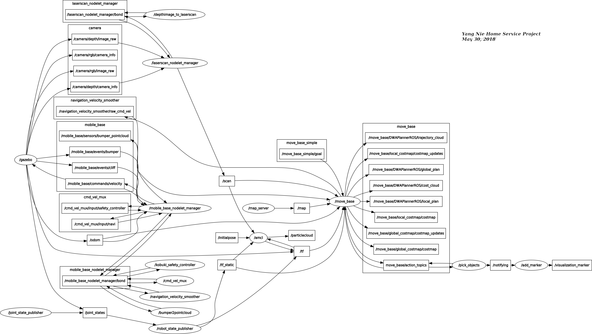
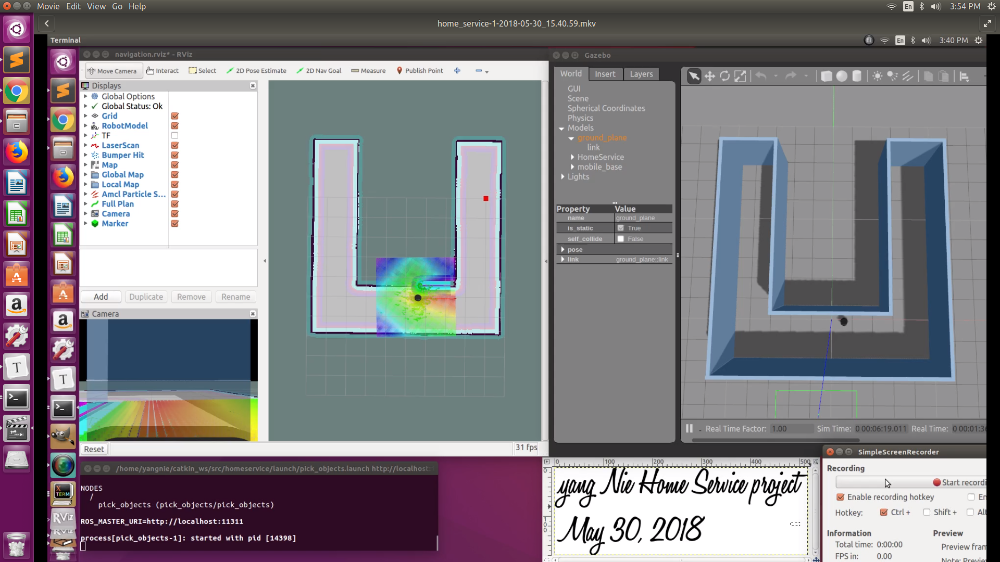
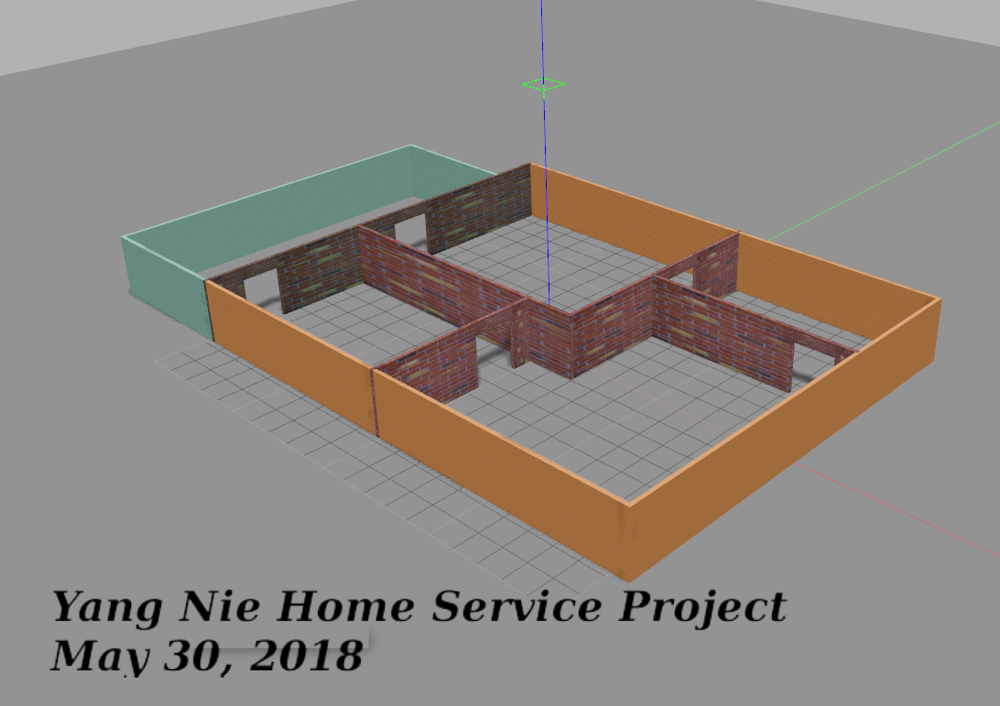

# Home Service project

##  Abstract:

Home Service project was implemented with a Robot, Map and virtual object in ROS Gazebo simulation environment. The turtlebot robot, a custom built map, slam-mapping algorithm, AMCL navigation algorithm and ROS marker were used in it. it simulated a full home service robot capable of navigating to pick up and deliver virtual objects. The result for the simulated robot will be discussed in this article.

## Introduction:

These 6 steps need to complete in this project,:

1. Preparing Catkin Workspace

2. Building a map

3. Testing SLAM

4. Using Wall Follower code to generate a digit map

5. Testing navigation and reaching multiple goals

6. Modeling virtual objects

   

     

   The final result shows a robot navigating in Rviz  and Gazebo windows with a map.

    


## Background / Tasks

#### Hardware Environment:

PC: HP Omen desktop

CPU: 8 x Intel(R) Core(TM) i7-7700K @4.20GHz

Memory:  64G

Hard disk:  512G SSD

GPU: GTX 1080i

#### Software Environment:

OS: Ubuntu 16.04

ROS: kinetic

Gazebo:  7.0.0

Rviz: 1.12.16

gcc:  5.4.0 

#### Tasks:

1. **Preparing Catkin Workspace**

Creating a catkin_ws workspace.

Installing these packages: [gmapping](http://wiki.ros.org/gmapping), [turtlebot_teleop](http://wiki.ros.org/turtlebot_teleop), [turtlebot_rviz_launchers](http://wiki.ros.org/turtlebot_rviz_launchers), [turtlebot_gazebo](http://wiki.ros.org/turtlebot_gazebo).

Creating a file folders structure as:




2. **Building a map**

Using **Building Editor** in Gazebo to create a map as:


Save this map as a world format file (homeservice.world) under homeservice/map folder.

3. **Testing SLAM**

Creating a test_slam.sh file to test SLAM manually.

Launch the test_slam.sh file and running the **keyboard_teleop** node, and start controlling the robot.


4. **Using Wall Follower code to generate a digit map**

This task was automating the process and let the robot follow the walls and autonomously map the environment while avoiding obstacles. To do so, the keyboard teleop node was replaced with a programming wall_follower node.
A wall follower algorithm is a common algorithm that solves mazes. This algorithm is also known as the left-hand rule algorithm or the right-hand rule algorithm depending on which is the project's priority. This wall follower can only solve mazes with connected walls, where the robot is guaranteed to reach the exit of the maze after traversing close to walls.
Here’s the wall follower algorithm(the left-hand one) at a high level:

````
If left is free:
    Turn Left
Else if left is occupied and straight is free:
    Go Straight
Else if left and straight are occupied:
    Turn Right 
Else if left/right/straight are occupied or you crashed:
    Turn 180 degrees

````

This algorithm has a lot of disadvantages because of the restricted space it can operate in. In other words, this algorithm will fail in open or infinitely large environments. Usually, the best algorithms for autonomous mapping are the ones that go in pursuit of undiscovered areas or unknown grid cells.



Using ````rosrun map_server map_saver -f homeservice ```` command, the two output map files were saved under homeservice/maps folder.




5. **Testing navigation and reaching multiple goals**

Creating a pick_objects node used C++ language. It needs to publish two goal positions to Robot. The ROS navigation stack creates a path for the robot based on **Dijkstra's** algorithm, a variant of the **Uniform Cost Search** algorithm, while avoiding obstacles on its path.

Using a positions.yaml file to load multiple set of goal position data so that pick_objects code can test multiple different starting and ending point goal in one run.

The configuration data  in positions.yaml as:

````
pick_object:
  run_1:
    start_point:
      x: 4.0
      y: 5
    end_point:
      x: -4.0
      y: 6
  run_2:
    start_point:
      x: 4.2
      y: 6
    end_point:
      x: -4.2
      y: 6.6
  run_3:
    start_point:
      x: 3.6
      y: 4
    end_point:
      x: -3.6
      y: 6.8

````

The positions.yaml file is located under homeservice/config folder.

Creating a pick_objects.sh script file which includes turlebot, AMCL, rviz and pick_objects nodes.




6. **Modeling virtual objects**

The final task of this project is to model a virtual object with markers in rviz. The virtual object is the one being picked and delivered by the robot, thus it should first appear in its pickup zone, and then in its drop off zone once the robot reaches it.

The code should follow this **algorithm**:

- Publish the marker at the pickup zone
- Pause 5 seconds
- Hide the marker
- Pause 5 seconds
- Publish the marker at the drop off zone

The two C++ classes were created in the add_markers package, they are:

1. marker class: It wrapped ROS marker base class and supported a higher level function call to create a marker.
2. marker_msg class: It include publisher and subscriber with callback function.

Creating a add_marker.sh script file which includes turlebot, AMCL, rviz and add_markers nodes.



#### Integrating all 6 step codes into one home service package

To complete this task, these four tasks need to add:

1. Initially show the marker at the pickup zone
2. Hide the marker once your robot reaches the pickup zone
3. Wait 5 seconds to simulate a pickup
4. Show the marker at the drop off zone once your robot reaches it

A Notify message was created to build a communication between **add_markers** and **pick_objects** nodes.

It defined as:

````
Header header       # header message
string name         # message name
float32 x           # position x
float32 y           # position y
int8 action         # action code
string message      # message text
````

The Notify.msg file is located  under pick_objects/msg folder.

The pick_objects code published the goal position message, and add_marker code subscribed notifying message and depending on these goal position data to show a marker on rviz window.

Creating a home_service.sh script file which includes turlebot, AMCL, rviz, pick_objects and add_markers nodes.

The nodes and topics relationship diagram as:





## Results:

The robot in this project complete these jobs successfully:

- Initially show the marker at the pickup zone
- Hide the marker once your robot reaches the pickup zone
- Wait 5 seconds to simulate a pickup
- Show the marker at the drop off zone once your robot reaches it

The pick_objects node loaded three different sets of pickup and drop off positions, then continued to run to different position smoothly.

Video link for Home Service project demo (https://youtu.be/wN6wdWHsIs8)

[](https://youtu.be/wN6wdWHsIs8)

## Discussion
An another custom map was built to test wall follower alorithm and code. It icluded five rooms with 5 doors. The wall follower code was failed to scan these room structure. There was no digital map generated from this wall follower code.




## Conclusion / Future Work
The current alorithm and codes were working in simple map environment very well, but it didn't do good job for real world. The wall follower alorithm and code definitly need to modify to enhance mapping process. Future work will be: using Jetson TX2 camera to scan the real room structure,  add four wheels, motor and control part on it to make a moving home service robot.


